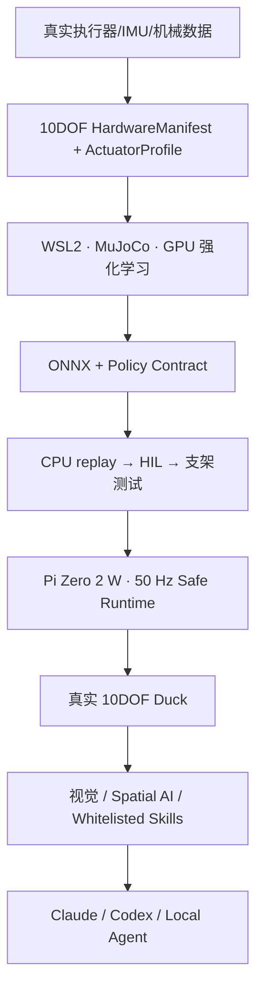

# Mini Duck Physical AI Platform

**基于 [Pollen Robotics Microduck](https://github.com/pollen-robotics/microduck) 与 [Microduck RL](https://github.com/pollen-robotics/microduck_rl) 路线开展的拓展性复现。** 从真实双足机器人出发，先把执行器、机械、供电和步态做可靠，再逐步加入视觉、空间理解与受控 Agent。

当前版本：**V0.4 Hardware-First** ｜ 当前 Gate：**H1 Hardware Qualification** ｜ H0 上游仿真基线：**已通过**

## 基于 Microduck，但不止于复刻

Microduck 证明了小型双足机器人可以在 MuJoCo 中训练策略、导出 ONNX，并以 50 Hz 在端侧闭环运行。本项目先复现这条公开的软件与强化学习链路，再面向个人开发者补齐一条更容易验证、修改和继续扩展的工程路径。

| 层次 | 本项目工作 |
|---|---|
| 可复现基线 | 固定 Microduck RL 上游 commit，在 WSL2 + NVIDIA GPU 中完成环境安装、PPO 训练、checkpoint、量化评估和视频证据 |
| 自有硬件 | 建立独立的 10DOF Duck，不照抄未公开的官方 Microduck 机械与电控；执行器、IMU、质量和关节参数由实测确定 |
| Hardware-First | 先比较 `STS3215-C044` / `C046`，再做单腿和全身，不用仿真结果代替真实硬件验收 |
| Sim2Real 工程 | 用 `HardwareManifest`、`ActuatorProfile`、Policy Contract 和 `SIM/HIL/REAL` 证据等级连接训练与真机 |
| 拓展方向 | 在可靠行走与恢复之上继续加入视觉、Spatial AI、白名单 Skill、Agent 和新的轮式/四足 embodiment |

这不是 Pollen Robotics 的官方分支或硬件复刻套件。上游代码、训练模型和资产遵守各自许可证并保持明确归属；本仓库新增的是 10DOF 目标硬件、资格测试、安全运行时和可审计的开发流程。

## 这个项目想做什么

最终目标不是做一个只能播放动作的鸭子模型，而是做一台可以在真实环境中完成闭环任务的机器人：

> 上电 → 自主站立 → 双足行走 → 发现人 → 主动靠近 → 被轻推倒 → 自主恢复 → 继续任务

Duck 是第一种 embodiment。项目真正沉淀的是可复用的硬件描述、训练方法、安全 runtime、空间数据和 Skill/Agent 接口；将来换成轮式或四足，上层能力仍能复用。



V0.4 的关键变化是 **No Hardware, No Done**：仿真、mock 和视频可以作为中间证据，但站立、行走、恢复、测绘或 Agent 控制只有在真实 Duck 上通过才能标记完成。

## 为什么先测硬件，再继续训练自有模型

同叫 STS3215 的舵机存在不同减速比和速度/扭矩特性。V0.4 第一批只对比：

- `STS3215-C044`：1:191，偏负载；
- `STS3215-C046`：1:147，偏速度；
- `BNO085`：新设计的主 IMU；`BNO055` 只保留兼容接口。

真实 step response、速度、温升、电流、延迟、deadband/backlash 和断连恢复会回写到 `ActuatorProfile`，再进入 10DOF MJCF、domain randomization 和真机 soft limit。这样训练出来的策略才有明确的 Sim2Real 对象。

## 现在要不要买硬件

**可以买第一批 H1 资格测试套件，但不要一次买满 10 个舵机。** 当前软件已经把硬件描述、测试日志、接口、安全状态和证据等级准备好；真实 STS3215 backend 与 BNO085 标定必须等设备到货后联调。

现在只采购：`C044 ×1`、`C046 ×1`、`Bus Servo Adapter (A) ×1`、`BNO085 ×1`，以及 7.4 V 限流电源、保险/物理断电和必要线材。H1 实测确定执行器分配后，再补齐一条 5DOF 腿；单腿通过后，才扩到 10DOF 全身、Pi 和电池。

完整 SKU 对比、关节分配假设、到货测试顺序、安全温度和分阶段采购触发器见 [`docs/HARDWARE_PURCHASE.md`](docs/HARDWARE_PURCHASE.md)。

## 当前真实进度

| 能力 | 状态 | 说明 |
|---|---|---|
| WSL2 Ubuntu + RTX GPU 训练环境 | ✅ 已实测 | Ubuntu 24.04.3、Python 3.12.3、RTX 5060 Ti 16 GB |
| 官方 Microduck 14DOF 长训练 | ✅ 已完成 | 4,096 env，103.1M step，GPU 平均/峰值 57.94%/88% |
| 固定直行量化评估 | ✅ 已通过 | `model_1000.pt`，128/128 不摔，0 NaN |
| “醉鸭拳”传播动作 | ✅ 已通过仿真验收 | 4,096 env，98.3M step；左右醉步、马步、探头出招、回撤和歪头收势；50 fps 策略回放 |
| 连续轮滑障碍秀 | ✅ 已通过仿真验收 | 19.64 s 一镜到底；0.337 m/s 带速甩弯、92.2° 弧线转向、0.483 m/s 以上低头穿杆、出杆渐起、341.1° 旋转与急停歪头；50 fps 回放 |
| V0.4 HardwareManifest | ✅ 已实现 | 10DOF joint order、C044/C046、BNO085、TBD_MEASURE |
| H1 qualification logger | ✅ mock 可运行 | 50 Hz、CSV/JSON；mock 只能产生 `SIM_PASS` |
| ServoBus / ImuBackend | ✅ 基础完成 | mock、BNO085、BNO055 compatibility；真实 STS3215 backend 待硬件 |
| 50 Hz 安全 runtime | ✅ mock 基础完成 | timeout、deadline、IMU stale/NaN、断连、soft-limit |
| 自有 10DOF RL 策略 | ⏳ 未完成 | 官方 14DOF policy 不能下发给目标硬件 |
| 真实舵机/单腿/全身 | ⏳ 未接入 | 等 H1 实物资格测试，不冒充 HIL/REAL |

正式训练证据见 [`2026-08-31-upstream-walk-training.md`](docs/experiments/2026-08-31-upstream-walk-training.md)；传播动作的设计、训练与检查点对比见 [`2026-09-01-drunken-boxing-training.md`](docs/experiments/2026-09-01-drunken-boxing-training.md)；带速甩弯、动态低头穿杆训练与逐项验收见 [`2026-09-01-roller-obstacle-showcase.md`](docs/experiments/2026-09-01-roller-obstacle-showcase.md)。这些结果证明训练链路能用，不代表 10DOF 真机已经会走或会做同样动作。

## 强化学习是在 WSL2 里训练的吗

**是。** 训练运行在 Windows 11 的 WSL2 Ubuntu 中，NVIDIA GPU 通过 WSL CUDA 提供给 PyTorch/MuJoCo。PowerShell 负责启动命令和管理文件，不执行 PPO 本身。

### 本机目录

| 内容 | Windows | WSL2 |
|---|---|---|
| 当前仓库 | `D:\vibe_code\02_sys3d\mini-duck-lite` | `/mnt/d/vibe_code/02_sys3d/mini-duck-lite` |
| Microduck RL 源码 | `D:\vibe_code\02_sys3d\_upstream\microduck_rl` | `/mnt/d/vibe_code/02_sys3d/_upstream/microduck_rl` |
| 正式训练 checkpoint | `D:\vibe_code\02_sys3d\_upstream\microduck_rl\logs\rsl_rl\velocity\2026-08-31_17-15-10_walk-baseline-4096x4000-20260831\model_1000.pt` | `/mnt/d/vibe_code/02_sys3d/_upstream/microduck_rl/logs/rsl_rl/velocity/2026-08-31_17-15-10_walk-baseline-4096x4000-20260831/model_1000.pt` |
| 训练/GPU/评估/视频日志 | `D:\vibe_code\02_sys3d\mini-duck-lite\artifacts\walk-training-2026-08-31-run2` | `/mnt/d/vibe_code/02_sys3d/mini-duck-lite/artifacts/walk-training-2026-08-31-run2` |

完整路径、训练命令和调参说明见 [`docs/WSL2_TRAINING.md`](docs/WSL2_TRAINING.md)。

### 后续自己调训练策略，主要改哪里

当前官方参考代码位于外置 Microduck RL checkout：

| 修改目标 | 文件 |
|---|---|
| 关节、执行器、HOME_FRAME | `src/mjlab_microduck/robot/microduck_constants.py` |
| MJCF、碰撞、质量和几何 | `src/mjlab_microduck/robot/microduck/*.xml` |
| reward、命令范围、DR、curriculum | `src/mjlab_microduck/tasks/microduck_velocity_env_cfg.py` |
| 自定义 reward/reset/观测函数 | `src/mjlab_microduck/tasks/mdp.py` |
| 训练 CLI | `src/mjlab_microduck/train_cli.py` |
| ONNX 导出 | `scripts/export.py` |

固定上游目录用于复现，脚本会拒绝 dirty checkout。自有 10DOF 应在个人 fork/新分支开发，重新固定 commit；先 64 env smoke，再扩大到 4,096 env，并沿用本仓库的 GPU CSV、TensorBoard/W&B offline、checkpoint 量化评估和视频证据。

## 安装 V0.4 开发工具

在 PowerShell 中调用 WSL2：

```powershell
wsl -d Ubuntu -- bash -lc 'cd /mnt/d/vibe_code/02_sys3d/mini-duck-lite && uv sync --all-groups'
wsl -d Ubuntu -- bash -lc 'cd /mnt/d/vibe_code/02_sys3d/mini-duck-lite && uv run pytest'
```

检查 HardwareManifest。返回 `valid=true`、`runtime_ready=false` 是当前正确结果：格式有效，但真实 bus ID、软限位、执行器分配和 HIL 数据尚未完成。

```bash
uv run mini-duck-hardware-audit config/hardware/reference-prototype-a.json
```

运行一次低成本 mock 资格测试并生成 CSV/JSON 日志：

```bash
uv run mini-duck-qualify \
  config/qualification/h1-c044-c046.json \
  artifacts/h1-c044-mock-quick \
  --sku STS3215-C044 --backend mock --quick
```

运行 50 Hz mock runtime：

```bash
uv run mini-duck-runtime \
  config/runtime/mock-10dof.json \
  artifacts/runtime-mock.jsonl \
  --backend mock --cycles 100
```

这些命令验证配置、logger 和 safety state，不会连接真实舵机，也不会生成 HIL/REAL 结论。

## 强化学习结果如何部署到真实硬件

部署不是把 `.pt` 文件直接拷给舵机，而是经过以下链路：

1. **H1/H2 实测**：得到真实 actuator、IMU、joint sign/zero/limit、供电和机械参数；
2. **自有 10DOF 训练**：在 WSL2 中训练与目标实体 joint order 一致的策略；
3. **导出 ONNX**：绑定 observation normalizer、action scale、50 Hz、训练 commit 和模型哈希；
4. **CPU replay**：确认 PyTorch、ONNX 与 MuJoCo replay 输出一致；
5. **生成 Policy Bundle**：`mini-duck-package-policy` 会拒绝 14DOF 或缺少 contract 的模型；
6. **HIL**：先单舵机、再一条腿、再支架/软垫全身；
7. **部署 Pi Zero 2 W**：Pi 本地执行 50 Hz ONNX inference、watchdog、telemetry 和 servo/IMU I/O；
8. **REAL Gate**：外部限流电源站立通过后，才进入电池无绳行走。

真机每 20 ms 的控制链为：

```text
读取 STS3215 + BNO085
  → 按 joint order 构造 observation
  → 使用训练时 normalizer
  → ONNX inference
  → action scale / sign / zero / soft limit
  → 写入舵机
  → telemetry + watchdog
```

command timeout、sensor stale、NaN、舵机断连、超限或 deadline miss 时，本地 runtime 必须独立进入 safe state；LLM、VLA、网络和地图不在 50 Hz hard loop 中。完整电气、目录与发布流程见 [`docs/HARDWARE_DEPLOYMENT.md`](docs/HARDWARE_DEPLOYMENT.md)。

## 仓库结构

```text
config/
├── hardware/             # HardwareManifest
├── qualification/        # H1 C044/C046 测试计划
├── runtime/              # 50 Hz runtime 配置
└── policy/               # 10DOF Policy Contract 模板
src/mini_duck_lite/
├── manifest.py           # 配置校验与 runtime readiness
├── hardware.py           # ServoBus / ImuBackend / mock
├── qualification.py      # CSV/JSON 资格测试 logger
├── runtime.py            # 50 Hz safety foundation
├── evidence.py           # SIM/HIL/REAL contract
└── policy_bundle.py      # ONNX 部署包
scripts/                  # WSL2 复现、正式训练与 checkpoint 评估
docs/                     # PRD、架构、训练、部署、Gate 和实验记录
```

## Gate 路线

```text
H0 仿真基线（已通过）
 → H1 两颗候选舵机 + IMU
 → H2 一条 5DOF 实体腿
 → H3 10DOF 全身 Stand
 → H4 无绳 2 m Walk
 → H5 Recovery
 → H6 找人并靠近
 → H7+ 地形 / SLAM / 3DGS / Spatial / Agent / VLA
```

详细预算、通过条件和止损点见 [`docs/ROADMAP.md`](docs/ROADMAP.md)。

## 文档入口

- [V0.4 产品执行版](docs/PRD.md)
- [系统架构](docs/ARCHITECTURE.md)
- [硬件与策略接口](docs/INTERFACES.md)
- [H1 硬件采购与资格测试](docs/HARDWARE_PURCHASE.md)
- [完整硬件、工具与预算清单](docs/HARDWARE_BOM.md)
- [WSL2 强化学习开发](docs/WSL2_TRAINING.md)
- [真机部署链路](docs/HARDWARE_DEPLOYMENT.md)
- [Hardware-First Roadmap](docs/ROADMAP.md)
- [当前进度](docs/PROGRESS.md)
- [上游版本与许可证](docs/UPSTREAM.md)
- [实验记录](docs/experiments/README.md)

## 上游参考

- [Microduck](https://github.com/pollen-robotics/microduck)：官方端侧运行架构、50 Hz 控制闭环、设备服务与安全设计参考；
- [Microduck RL](https://github.com/pollen-robotics/microduck_rl)：mjlab/MuJoCo 强化学习基线；
- [Open Duck Mini v2](https://github.com/apirrone/Open_Duck_Mini/tree/v2)：约 42 cm 机械、BOM 与 Sim2Real 参考；
- [Open Duck Mini Runtime](https://github.com/apirrone/Open_Duck_Mini_Runtime)：Pi Zero 2 W、IMU、motor controller、offset 和 ONNX runtime 范式。

上游代码和模型资产保持仓库外置并固定 commit；硬件参数与 joint calibration 不直接照抄，必须由本项目 H1/H2 实测确认。
