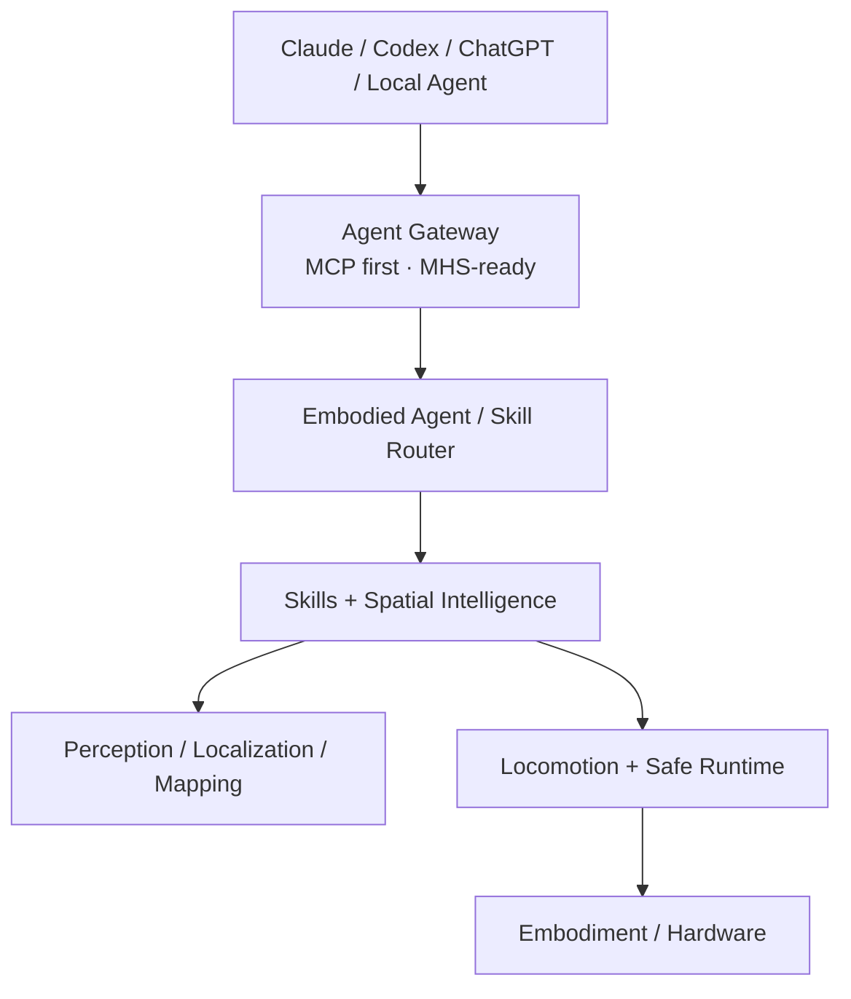

# Mini Duck Physical AI Platform

一个以低成本双足机器人为第一载体的 Physical AI 实验平台：先让身体可靠行动，再理解空间，最后让不同 AI Agent 通过安全、标准化接口使用真实机器人。

Duck V0.1 是第一种 embodiment，目标为 10DOF 双腿、自主站立与行走、跌倒恢复、视觉找人和安全靠近。平台本身不写死到“小鸭外壳”或 10 个关节；未来的定位、地图、Spatial Memory、Skill Router 与 Agent Gateway 应能复用于轮式、四足等本体。

## 当前状态

**当前 Gate：G0 · 上游仿真基线复现。**

本仓库目前只负责：

- 固定 Microduck RL、Open Duck Playground 与 MuJoCo 参考 commit；
- 检查 WSL2、Python、uv、Git、GPU 等开发环境；
- 提供官方 task registry、viewer/policy 与小规模训练 smoke 的可复现入口；
- 保存真实命令、版本、日志和失败证据。

G0 未通过前，不开始自有 10DOF MJCF、长时间 PPO、硬件采购、SLAM/3DGS 或外部 Agent 真机写操作。

## 平台分层



硬实时控制、感知定位、Skill 和 Agent 分属不同频率与故障域。Agent 只能调用白名单 Skill；50 Hz 控制环不依赖 LLM、网络或地图优化。

## 本机快速检查

在 PowerShell 中：

```powershell
wsl -d Ubuntu -- bash -lc 'cd /mnt/d/vibe_code/02_sys3d/mini-duck-lite && bash scripts/wsl_bootstrap.sh'
wsl -d Ubuntu -- bash -lc 'cd /mnt/d/vibe_code/02_sys3d/mini-duck-lite && uv run mini-duck-g0'
```

输出是环境审计 JSON，只表示本机前置条件，不表示 G0 已通过。

## 上游 G0 验证

先在本仓库之外检出 `docs/UPSTREAM.md` 固定的 Microduck RL commit，然后执行：

```bash
bash scripts/run_g0_upstream_smoke.sh /path/to/microduck_rl
```

该命令验证 commit、依赖、task registry 和上游 CPU tests。只有明确授权 GPU 小规模训练时才执行：

```bash
bash scripts/run_g0_upstream_smoke.sh /path/to/microduck_rl --train-smoke
```

官方 viewer/policy 仍需要有效 checkpoint；实际命令与结果必须记录到 `docs/experiments/`，不能用自制 tether 模型替代。

## 文档入口

- [产品范围](docs/PRD.md)
- [系统架构](docs/ARCHITECTURE.md)
- [核心接口](docs/INTERFACES.md)
- [Gate 路线](docs/ROADMAP.md)
- [当前进度](docs/PROGRESS.md)
- [决策记录](docs/DECISIONS.md)
- [上游基线](docs/UPSTREAM.md)

## 当前明确不做

- 不把持续遥控作为 Hero Demo 输入；
- 不让 LLM/VLA 直接输出舵机角度；
- 不在 G0 购买整套舵机或开始长训练；
- 不把 3DGS 写死为导航地图；
- 不以卡通几何代理冒充 Microduck/Open Duck 工业结构；
- 不将未实测物理参数包装成 Sim2Real 结果。
