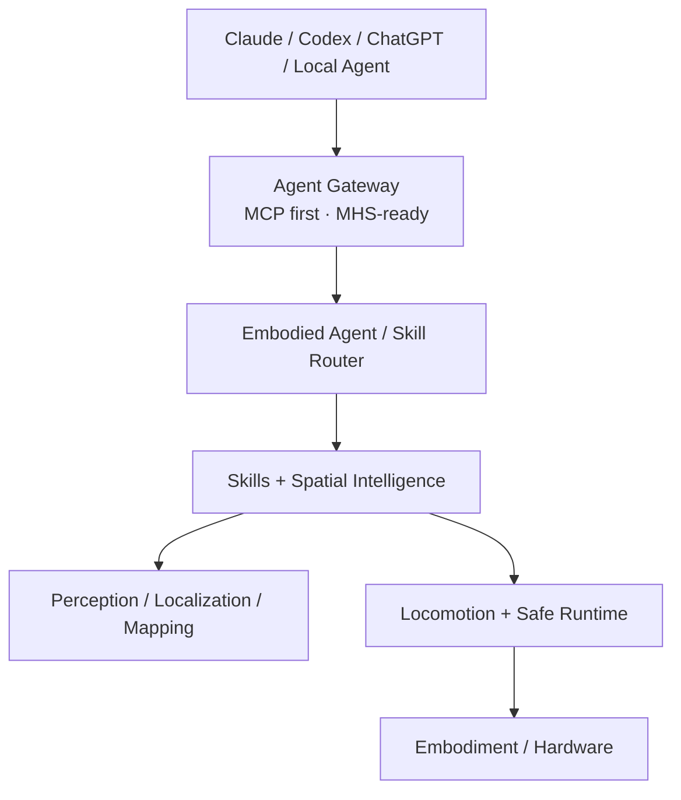

# Mini Duck Physical AI Platform

一个以低成本双足机器人为第一载体的 Physical AI 实验平台：先让身体可靠行动，再理解空间，最后让不同 AI Agent 通过安全、标准化接口使用真实机器人。

Duck V0.1 是第一种 embodiment，目标为 10DOF 双腿、自主站立与行走、跌倒恢复、视觉找人和安全靠近。平台本身不写死到“小鸭外壳”或 10 个关节；未来的定位、地图、Spatial Memory、Skill Router 与 Agent Gateway 应能复用于轮式、四足等本体。

## 当前状态

**当前 Gate：G0 · 上游仿真基线复现。**

本仓库目前只负责：

- 固定 Microduck RL、Open Duck Playground 与 MuJoCo 参考 commit；
- 检查 WSL2、Python、uv、Git、GPU 等开发环境；
- 提供官方 task registry、viewer/policy 与小规模训练 smoke 的可复现入口；
- 保存真实命令、版本、日志和失败证据。

G0 未通过前，不开始自有 10DOF MJCF、长时间 PPO、硬件采购、SLAM/3DGS 或外部 Agent 真机写操作。

### 启动与训练的真实状态

| 项目 | 状态 | 说明 |
|---|---|---|
| WSL2 / Python / uv / Git / NVIDIA GPU 检查 | ✅ 已完成 | 已在目标电脑实测，环境审计结果见 `docs/experiments/` |
| Microduck RL 固定版本与任务入口 | ✅ 已配置 | 已固定上游 commit 和 `Mjlab-Velocity-Flat-MicroDuck` task ID |
| 机器人初始姿态加载与仿真启动 | ⏳ 未实测 | 当前仓库没有自有机器人模型；尚未用官方 viewer 验证 reset 后的站立姿态、关节角和接触状态 |
| 官方 checkpoint 加载与策略推理 | ⏳ 未执行 | 尚无经过本机验证的有效 checkpoint 和 viewer/policy 运行记录 |
| 强化学习最小训练 | ⏳ 未执行 | 已提供 64 env / 5 iteration 命令入口，但尚未运行，未生成训练日志或 checkpoint |
| 自有 10DOF 强化学习训练 | 🚫 尚未开始 | 属于 G1；必须在 G0 上游基线复现通过后开始 |

因此，当前的“环境可用”不等于“机器人已经启动并完成强化学习训练”。执行
`uv run mini-duck-g0` 只做只读环境审计；只有显式运行
`scripts/run_g0_upstream_smoke.sh <microduck_rl_checkout> --train-smoke`
才会触发上游的 5 iteration 最小训练。

## 平台分层



硬实时控制、感知定位、Skill 和 Agent 分属不同频率与故障域。Agent 只能调用白名单 Skill；50 Hz 控制环不依赖 LLM、网络或地图优化。

## 本机快速检查

在 PowerShell 中：

```powershell
wsl -d Ubuntu -- bash -lc 'cd /mnt/d/vibe_code/02_sys3d/mini-duck-lite && bash scripts/wsl_bootstrap.sh'
wsl -d Ubuntu -- bash -lc 'cd /mnt/d/vibe_code/02_sys3d/mini-duck-lite && uv run mini-duck-g0'
```

输出是环境审计 JSON，只表示本机前置条件，不表示 G0 已通过。

## 上游 G0 验证

先在本仓库之外检出 `docs/UPSTREAM.md` 固定的 Microduck RL commit，然后执行：

```bash
bash scripts/run_g0_upstream_smoke.sh /path/to/microduck_rl
```

该命令验证 commit、依赖、task registry 和上游 CPU tests。只有明确授权 GPU 小规模训练时才执行：

```bash
bash scripts/run_g0_upstream_smoke.sh /path/to/microduck_rl --train-smoke
```

官方 viewer/policy 仍需要有效 checkpoint；实际命令与结果必须记录到 `docs/experiments/`，不能用自制 tether 模型替代。

## 文档入口

- [产品范围](docs/PRD.md)
- [系统架构](docs/ARCHITECTURE.md)
- [核心接口](docs/INTERFACES.md)
- [Gate 路线](docs/ROADMAP.md)
- [当前进度](docs/PROGRESS.md)
- [决策记录](docs/DECISIONS.md)
- [上游基线](docs/UPSTREAM.md)

## 开发看板

### 已完成

- [x] 按 Physical AI Platform V0.3 重构产品范围、分层架构和 Gate 路线；
- [x] 固定 Microduck RL、Open Duck Playground 与 MuJoCo 上游版本；
- [x] 完成目标电脑的 WSL2、Python、uv、Git、GPU 环境审计；
- [x] 提供 G0 命令行审计工具、自动化测试和可复现构建；
- [x] 提供上游 registry、CPU tests 与最小训练 smoke 的统一脚本入口；
- [x] 建立实验记录目录，区分“已实测结果”和“计划执行项”。

### TODO：当前 Gate G0

- [ ] 在仓库外检出 Microduck RL 固定 commit，并完成 `uv sync`；
- [ ] 运行 `uv run list-envs`，确认官方任务已正确注册；
- [ ] 运行上游 CPU tests，并保存完整结果；
- [ ] 启动官方 viewer，核对初始姿态、关节角、足底接触和模型朝向；
- [ ] 使用有效 checkpoint 启动官方 policy 推理，确认机器人能够在仿真中执行动作；
- [ ] 运行 64 env / 5 iteration 强化学习 smoke；
- [ ] 记录命令、耗时、显存、训练指标、checkpoint 和失败信息；
- [ ] 所有验收项通过后，将 G0 标记为完成并进入 G1。

### TODO：下一 Gate G1

- [ ] 基于真实结构参数建立自有 10DOF MJCF 与执行器配置；
- [ ] 定义可复现的中立站立姿态、reset 流程、关节限位和自碰撞规则；
- [ ] 锁定 observation、action、控制频率和 Policy Contract；
- [ ] 设计站立、行走、扰动恢复 reward 与 curriculum；
- [ ] 增加摩擦、质量、时延和执行器误差的 domain randomization；
- [ ] 完成长时间 PPO 训练、checkpoint 评估与 ONNX CPU replay。

详细 Gate 验收条件以 [`docs/ROADMAP.md`](docs/ROADMAP.md) 为准；README 只展示最近状态。

## 当前明确不做

- 不把持续遥控作为 Hero Demo 输入；
- 不让 LLM/VLA 直接输出舵机角度；
- 不在 G0 购买整套舵机或开始长训练；
- 不把 3DGS 写死为导航地图；
- 不以卡通几何代理冒充 Microduck/Open Duck 工业结构；
- 不将未实测物理参数包装成 Sim2Real 结果。
