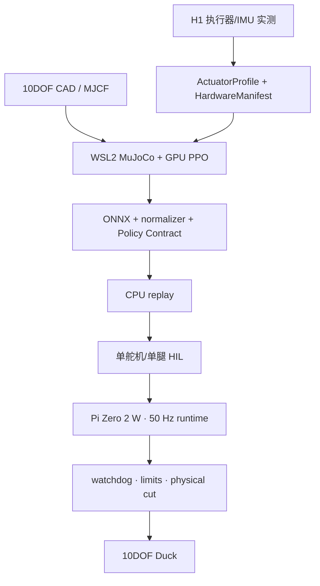
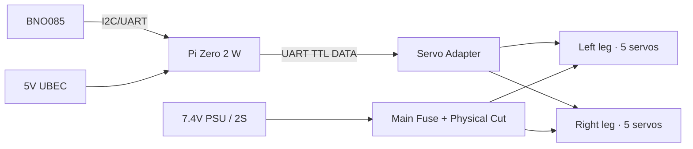
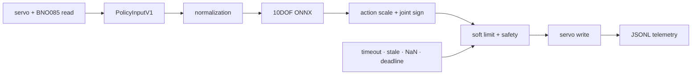
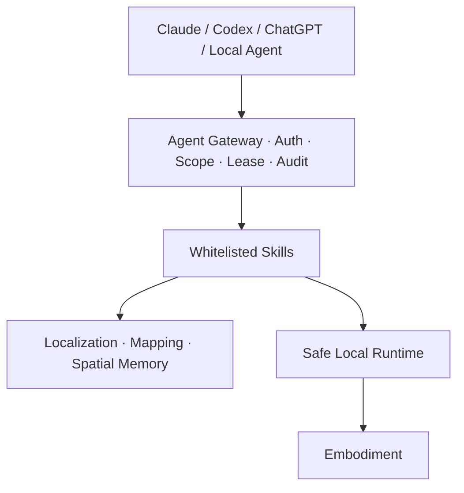

# V0.4 系统架构

## Hardware-First 主线

训练模型必须吸收真实执行器、重心、质量、摩擦和时延数据。仿真负责高并发试错，真实 Gate 负责证明它能控制物理设备。

## 三台“计算机”的职责

| 位置 | 职责 | 不做什么 |
|---|---|---|
| Windows 宿主 | 文件管理、Codex 开发、视频与实验材料 | 不运行硬实时控制 |
| WSL2 Ubuntu + RTX GPU | MuJoCo/mjlab、PPO、评估、ONNX 导出 | 不直接连真机舵机母线 |
| Pi Zero 2 W | 50 Hz ONNX inference、watchdog、telemetry、servo/IMU I/O | 不训练大模型，不等待 LLM/网络 |

## 真实硬件结构

Adapter 是通讯组件，不是 10DOF PDB。舵机电源与逻辑 5V 分离，首次全身测试使用限流外部电源。

## 本地控制循环

控制周期为 20 ms。任何 command timeout、sensor stale、NaN、舵机断连、超限或 deadline miss 都进入 safe state。LLM、VLA、mapping 和远程 UI 不进入这个 hard loop。

## 上层平台仍然保留

这些层只在对应真实 Gate 实现。外部 Agent 永远不获得 raw bus、joint angle 或 torque 写权限。

## 当前落地模块

| 模块 | V0.4 状态 |
|---|---|
| `manifest` | 10DOF HardwareManifest 校验与 fail-closed readiness |
| `hardware` | ServoBus/ImuBackend、mock、BNO085、BNO055 compatibility |
| `qualification` | H1 plan、CSV/JSON logger、mock dry run |
| `runtime` | 50 Hz mock loop、安全状态基础 |
| `policy_bundle` | 10DOF ONNX/contract/hash 部署包 |
| `evidence` | SIM/HIL/REAL 证据字段校验 |

真实 STS3215 backend、ONNX provider 和 Pi service 要等 H1 数据与硬件 revision 锁定后实现。
