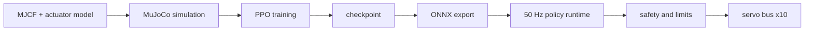
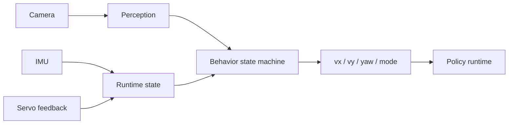

# 系统架构

## 训练与部署边界

## 当前实现

本轮只实现训练侧最小地基：

- `mini_duck_lite.xml`：10 个主动关节、10 个位置执行器、IMU 和足底接触；
- `contracts.py`：固定关节顺序、控制频率和 home pose；
- `simulation.py`：500 Hz MuJoCo 物理步进、50 Hz 关节目标更新、遥测与快照；
- `tests/`：在无 GPU、无真机条件下锁住模型契约。

调试 tether 只用于第一步 articulation smoke。后续 walk/recovery 环境不得依赖 tether。

## 未来模块边界

- `training/`：PPO 环境、reward、domain randomization、checkpoint；
- `export/`：把 observation normalizer 与 policy 一起导出 ONNX；
- `runtime/`：固定 50 Hz observation → infer → limit → servo loop；
- `perception/`：输出可见性、横向偏差、尺度代理和置信度；
- `behavior/`：BOOT、SAFE_STAND、SEARCH、APPROACH、FALLEN、RECOVERING、FAULT。
