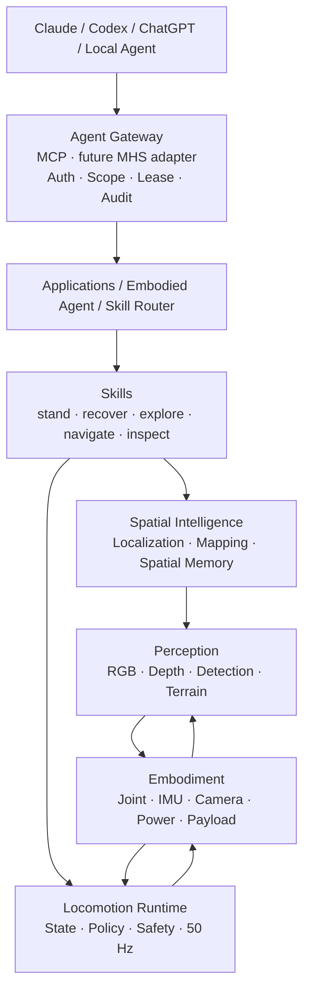
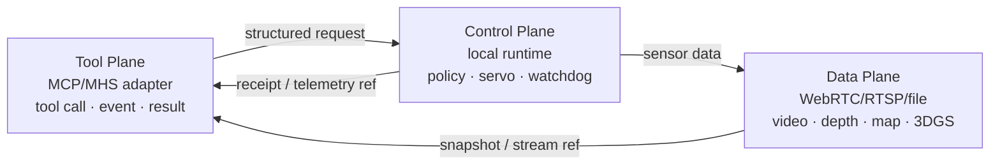
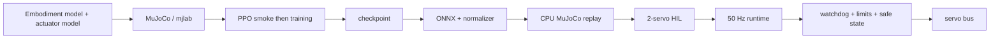
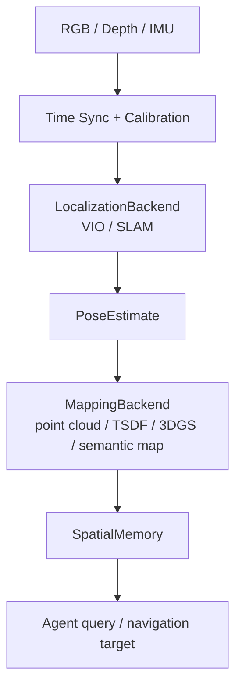
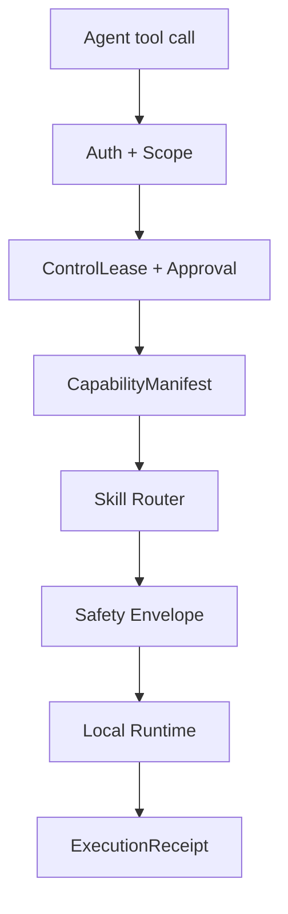

# 系统架构

## 总体分层

依赖方向从上层意图流向稳定契约，再进入本地执行。任何上层组件崩溃、断网或超时，都不能阻止 runtime 进入 safe state。

## 时序与故障域

| Loop | 建议频率 | 职责 | 禁止依赖 |
|---|---:|---|---|
| Control | 50 Hz | joint/IMU read -> policy -> safety -> servo write | LLM、云 API、mapping、远程 UI |
| Perception / Localization | 10-30 Hz | detection、depth、VIO、pose | token-by-token Agent 决策 |
| Mapping | 1-30 Hz | point cloud、TSDF、3DGS 或 semantic backend | hard runtime |
| Behavior / Skill | 5-20 Hz / event | 状态机、Skill 生命周期、重试与取消 | raw servo bus |
| Agent / VLM / LLM | 非实时 | 任务规划、空间查询、失败重规划 | 50 Hz 控制 deadline |

## 三个 Plane

视频、Depth 和 3D artifact 走 Data Plane；Agent 读取 snapshot、语义结果或 stream reference，不逐帧 reasoning。持续动作由本地 Skill/Policy 执行，Agent 只负责高层计划和异常处置。

## Locomotion 训练与部署

G0 只复现上游链路；G1 才建立自有 10DOF embodiment。质量、惯量、摩擦、时延和 actuator 参数没有实测来源时必须标记 `TBD_MEASURE`。

## Spatial AI 数据流

3DGS 是可替换 MappingBackend，不是 locomotion 或 Spatial Memory 的内部依赖。导航先需要稳定几何与可通行性，高质量渲染是独立价值。

## Agent-Hardware 安全路径

远程 Agent 永不获得 `set_joint_angle`、`set_torque` 或 `raw_bus_write`。`stop` 使用独立高优先级安全路径。

## 目标模块边界

| 模块 | 稳定职责 | 首次实现 Gate |
|---|---|---:|
| `embodiment` | Joint/Frame/Sensor/Capability contract | G1 |
| `training` | task、reward、DR、checkpoint、export | G1 |
| `runtime` | 50 Hz state -> policy -> safety -> bus | G2/G3 |
| `perception` | 目标和地形结构化输出 | G6/G7 |
| `spatial` | localization、mapping、entity、memory | G8-G10 |
| `skills` | 生命周期、precondition、progress、failure | G6.5/G11 |
| `gateway` | MCP、auth、lease、approval、audit | G6.5/G11.5 |
| `adapters` | VLA、WAM、MHS 等实验提供者 | G11.5-G13 |

当前仓库只落地 G0 环境与上游复现工具，不能用空目录假装未来模块已经实现。
