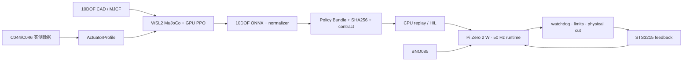

# 从强化学习策略到真实硬件

## 部署结论

训练发生在 WSL2 + GPU；真实机器人只运行推理和安全控制。最终的 10DOF ONNX 策略部署到 Raspberry Pi Zero 2 W，由本地 50 Hz runtime 读取关节与 BNO085，执行归一化和 ONNX 推理，再经过 joint order、action scale、soft limit、watchdog 和物理急停后写入 STS3215 总线。

官方 14DOF `model_1000.pt` 不能直接控制 V0.4 的 10DOF 实体。必须先完成自有 10DOF 模型、实测 ActuatorProfile 和 Policy Contract。

## 数据与控制链



## 部署包包含什么

`mini-duck-package-policy` 只接受 10DOF、50 Hz 且带 normalizer 与 training commit 的 contract，输出：

```text
policy-bundle/
├── policy.onnx
├── policy-contract.json
└── bundle-manifest.json
```

`bundle-manifest.json` 保存模型和 contract 的 SHA256。工具生成 bundle 后仍保持 `real_hardware_enabled=false`，只有 HIL 验收和人工批准可以进入真机。

```bash
uv run mini-duck-package-policy \
  /path/to/self-10dof-policy.onnx \
  config/policy/policy-contract-v1.json \
  artifacts/policy-bundle
```

当前仓库提供的是 contract 模板；官方 14DOF ONNX 会因 action size/joint order 不匹配而被拒绝。

## Raspberry Pi 目标结构

Pi Zero 2 W 使用 64-bit Raspberry Pi OS Lite。建议目标目录：

```text
/opt/mini-duck/
├── app/                 # 固定 commit 的 runtime
├── config/
│   ├── hardware.json    # bus ID、方向、零位、软限位、硬件 revision
│   └── runtime.json     # 50 Hz、timeout、watchdog
├── policies/current/    # policy bundle
└── logs/                # JSONL telemetry 与 safety event
```

部署时从开发机复制经过验收的 bundle，而不是在 Pi 上训练：

```bash
rsync -av --delete artifacts/policy-bundle/ \
  duck@<robot-ip>:/opt/mini-duck/policies/current/
```

Open Duck Mini Runtime 的公开实现已经验证了 Pi Zero 2 W、I2C IMU、USB/serial motor controller、joint offset 配置和 ONNX walk 的总体路径；本项目只借鉴部署范式，不直接把它的关节配置当成自己的校准结果。

## 50 Hz 真机循环

每 20 ms 执行一次：

1. 读取 10 个舵机的位置、速度、电流、温度和在线状态；
2. 读取 BNO085 姿态与角速度，并检查 timestamp/calibration；
3. 按 Policy Contract 的 joint order 构造 observation；
4. 应用训练时相同的 normalization；
5. 运行 ONNX Runtime，得到 10 维 action；
6. 应用 action scale、方向、零位和 soft limit；
7. 写入 STS3215 bus，并记录 telemetry；
8. command 超时、sensor stale、NaN、掉线、超限或 deadline miss 时立即撤销 torque/进入安全姿态。

LLM、VLA、3DGS、网络和远程 UI 都不在这条 hard loop 中。

## 物理联动顺序

| Gate | 真实对象 | 通过条件 |
|---|---|---|
| H1 | C044×1、C046×1、BNO085 | 50 Hz step/速度/温升/延迟/断连数据归档，决定执行器组合 |
| H2 | 一条 5DOF 实体腿 | 支架上连续 30 min、无机械干涉、峰值电流已知 |
| H3 | 10DOF 全身 + 外部限流电源 | 10 次上电至少 8 次安全 stand，brownout=0 |
| H4 | 2S 电池无绳行走 | 2 m ×10，至少 7 次成功 |
| H5/H6 | 恢复与找人 | 真实恢复、视觉靠近 Hero Demo |

首次全身测试使用独立高电流舵机母线、保险、物理断电和限流电源；Bus Servo Adapter (A) 只承担通讯/资格测试，不能作为 10DOF 整机 PDB。

## 当前尚未完成

- 真实 C044/C046 与 BNO085 尚未连接，只有 mock backend；
- 真实 bus ID、零位、方向、软限位、峰值电流仍为 `TBD_MEASURE`；
- 自有 10DOF MJCF/策略/ONNX 尚未完成；
- Raspberry Pi systemd service、真实 STS3215 backend 和 ONNX policy provider 尚待 H1/H2 数据确定后实现；
- 因此当前状态是 `Hardware Qualification Ready`，不是“已部署真机”。
