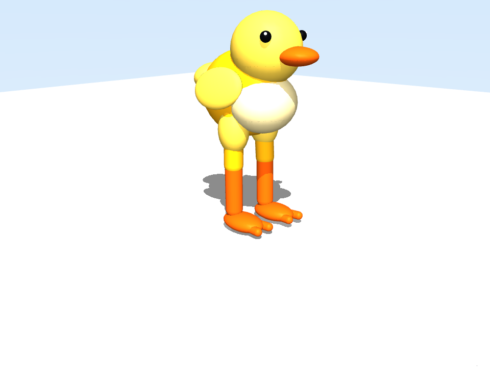

# G0/G1 第一仿真记录

日期：2026-08-31

## 目标

验证 WSL2 中的 Python/MuJoCo 工具链能够加载自有 10DOF MJCF，并以 500 Hz 物理步进、50 Hz 控制更新完成可重复的无界面仿真。测试只证明模型、合同、遥测和渲染链路，不证明已学会站立或行走。

## 环境

- Ubuntu 24.04.3 LTS on WSL2；
- Python 3.12.3；
- uv 0.11.7；
- MuJoCo 3.12.0；
- NVIDIA GeForce RTX 5060 Ti，16 GB；
- 依赖由仓库 `uv.lock` 固定。

## 命令

```bash
cd /mnt/d/vibe_code/02_sys3d/mini-duck-lite
uv sync --all-groups
uv run pytest

MUJOCO_GL=egl uv run mini-duck-sim \
  --duration 2 \
  --render \
  --output artifacts/g0-first-simulation

MUJOCO_GL=egl uv run mini-duck-sim \
  --duration 2 \
  --untethered \
  --render \
  --output artifacts/g0-free-base-render
```

## 结果

| 检查 | tethered articulation | free base |
|---|---:|---:|
| physics steps | 1,000 | 1,000 |
| telemetry samples | 100 | 100 |
| joints / actuators / sensors | 10 / 10 / 5 | 10 / 10 / 5 |
| finite state | true | true |
| final base z | 0.340597 m | 0.085670 m |
| max absolute joint velocity | 5.322982 rad/s | 7.098056 rad/s |
| result | pass | 数值通过，姿态跌倒 |

测试集结果：`4 passed`。

本轮同时重做了视觉代理：用独立头部、眼睛高光、腹部、短翅、尾部和圆润鸭掌替代原来的基础几何块，并将离屏快照提高到 960×720。关节、执行器和传感器命名及数量保持不变。



## 结论

WSL2、依赖锁、MJCF、10DOF joint contract、50 Hz 控制更新、JSONL 遥测和 EGL 离屏渲染均已打通。关闭 tether 后模型在 2 秒内跌倒，说明当前还没有自由站立能力；下一步必须做质心/接触分析和 stand/walk policy smoke，不能把本次结果描述为行走成功。

## 环境提示

WSL 启动时报告 `/etc/wsl.conf` 中 `user.default` 重复。该提示不影响本次运行，因此未修改系统级配置。
