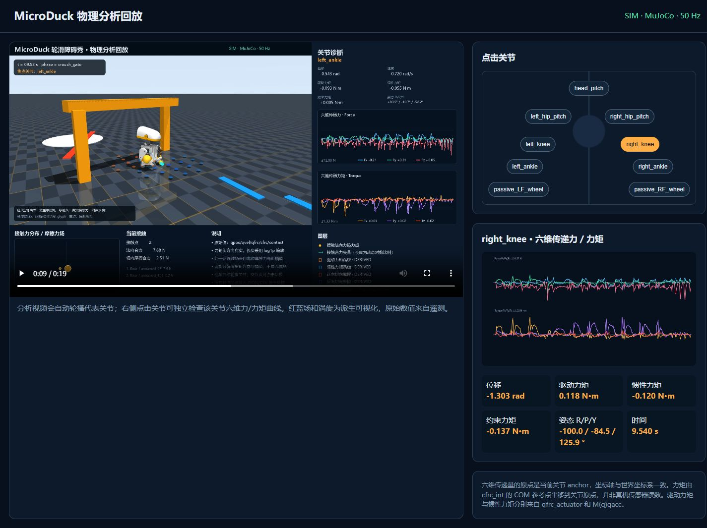
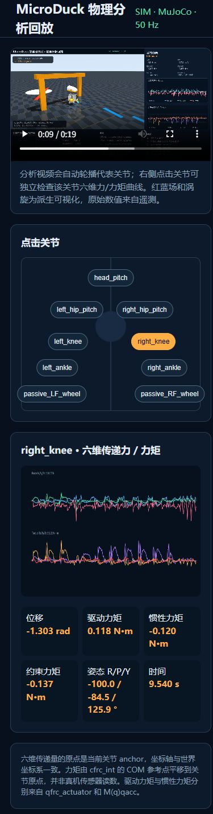

# REF-0001 验证记录

日期：2026-09-05。审查基线：`3ceb4c92b407b2bed4f12216d94abb639c612033`。本次修改与回归映射见 [02-实施](02-实施.md)。

## 项目验收

环境为 Windows 工作区、WSL2 Ubuntu / Python 3.12 / uv；所有项目命令在 `/mnt/d/vibe_code/02_sys3d/mini-duck-lite` 执行。`artifacts/code-fix-20260905/` 是忽略的本地原始日志目录，以下源码测试及发布校验入口随仓库提交。

| 实际命令 | 实际结果 |
|---|---|
| `uv sync --all-groups` | 退出 0，解析 12 个包，检查 11 个包 |
| `uv run pytest` | **151 passed in 8.15s** |
| `uv run mini-duck-g0` | 退出 0，本地环境前置检查通过；H1 未执行 |
| `uv run mini-duck-hardware-audit config/hardware/reference-prototype-a.json` | 退出 0，未实测清单保持不可用于 runtime |
| `uv run mini-duck-qualify config/qualification/h1-c044-c046.json artifacts/code-fix-20260905/acceptance/h1-mock --sku STS3215-C044 --quick` | 退出 0，SIM_PASS；92 样本，模拟控制时间 1.84 s，实际执行约 0.0214 s；`timing_mode=simulated`，不具备 Gate 准入资格 |
| `uv run mini-duck-runtime config/runtime/mock-10dof.json artifacts/code-fix-20260905/acceptance/runtime.jsonl --cycles 100` | 退出 0，100 个 RUNNING 周期，0 个 safe-state 周期，SIM_PASS |
| `uv build` | 退出 0，生成 0.4.0 sdist 和 wheel |
| `python3 training/releases/roller-fast-carve-v1/verify_release.py` | **Release verification passed: 26 payload files** |
| `git diff --check` | 退出 0；仅有 Git LF/CRLF 提示 |

项目回归覆盖无效/过期反馈、实际软限位、慢读写、故障锁存、断连、BNO055 四元数、失败退出码、真实 ONNX 图与 normalizer、未知硬件参数、温度停止、50 Hz 时钟、逐环境漂移和非零偏航目标。完整模拟 30 分钟资格测试验证 90,000 个样本，间隔 20 ms，首末时间跨度 1799.98 s。额外覆盖最终读取超期、torque-off/close 清理失败仍保留失败摘要。

## 训练评估与物理发布包

在忽略的 `artifacts/code-fix-20260905/training/upstream-replay` 导出上游固定提交 `d424a0c899f6b33cbd3daeb279913134349c0b63`，顺序应用发布补丁 0001–0003，再对新增 0004 执行 `git apply --check` 和应用，均退出 0。外部上游工作区未修改。

隔离树以 `PYTHONPATH=src:scripts` 使用已有上游 Python，执行 `pytest` 的以下四个文件：`tests/test_joint_wrench.py`、`tests/test_physics_overlay.py`、`tests/test_showcase_timeline.py`、`tests/test_roller_crouch_cfg.py`。结果 **13 passed，98.58 s**。关节力矩测试在两个朝向下与 MuJoCo anchor 处力/力矩传感器对照，包括非零 4.905 N·m 静态力矩。

通过生产 `run_evaluation` 函数的受控恒定轨迹回归，持续相反的 ±0.4 m/s 横向漂移及 ±0.8 rad/s 偏航均为 FAIL；正确跟踪 0.5 rad/s 偏航目标为 PASS。这些是验收逻辑测试，没有重新训练策略或重写历史训练成绩。

完整物理回放实际命令（在隔离树执行）：

```bash
MUJOCO_GL=egl PYTHONPATH=src:scripts PYTHONUNBUFFERED=1 \
  /mnt/d/vibe_code/02_sys3d/_upstream/microduck_rl/.venv/bin/python scripts/run_roller_showcase.py \
  --roller /mnt/d/vibe_code/02_sys3d/mini-duck-lite/training/releases/roller-fast-carve-v1/weights/upstream_roller.onnx \
  --crouch /mnt/d/vibe_code/02_sys3d/mini-duck-lite/training/releases/roller-fast-carve-v1/weights/dynamic_crouch_model_400.onnx \
  --spin /mnt/d/vibe_code/02_sys3d/mini-duck-lite/training/releases/roller-fast-carve-v1/weights/spin_model_500.onnx \
  --no-video --analysis-video ../generated/roller_fast_carve_physics_overlay_50fps.mp4 \
  --physics-json ../generated/roller_fast_carve_physics_telemetry.json \
  --physics-csv ../generated/roller_fast_carve_physics_telemetry.csv \
  --viewer-dir ../generated/physics-viewer \
  --metrics ../generated/roller_fast_carve_physics_replay_metrics.csv \
  --summary ../generated/roller_fast_carve_physics_replay_summary.json \
  --fps 50 --width 1280 --height 720
```

结果退出 0，5 项路线检查全部 PASS。输出分析视频为 **974 帧、50 fps、1920×1080、19.48 s**；全部遥测为有限数。力矩修正最大差值为 1.2841338739777315 N·m。路线 CSV 的 SHA256 保持为 `95827e6f74057bed42b73c6ebf53b786621cffe6f0a07155f9619547511c71fd`，所有数值路线摘要、原权重和纯净证据哈希不变。

## 浏览器验收

实际启动 `python -m http.server 8096 --bind 127.0.0.1 --directory training/releases/roller-fast-carve-v1/evidence` 并访问 `/physics-viewer/`，验证 1440×1000 宽屏及 390×844 移动端。点击左膝、拖动时间轴至 9.54 s、切换右膝后，关节选择、曲线、数值与坐标说明正确更新。移动端页面宽度与视口均为 390 px，无横向溢出；浏览器控制台 error/warn 均为 0。

以下为真实运行页面截图，作为本次验证证据保留：





## 验证边界

本次未接入真实硬件，H1 仍未通过，不产生 HIL/REAL 结论。同步后端正在执行的 I/O 无法由 Python runtime 抢占，真实总线必须实现有限超时并完成 watchdog 与最大延迟实测。历史 checkpoint 的完整批量评估未重跑，旧实验仍按其原版本语义阅读。
