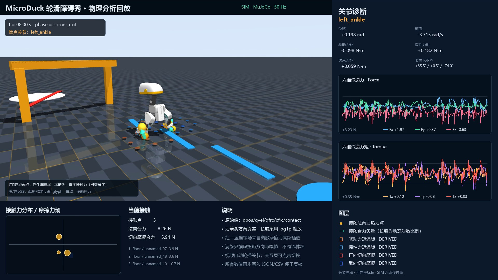

# Roller Fast Carve Gate · 可复现训练发布包

这是 2026-09-01 完成、2026-09-02 增补物理遥测、2026-09-05 修正关节力矩参考点的 Microduck **连续轮滑障碍秀 v1.1.1**。目标不是做一段关键帧动画，而是在连续物理仿真中组合三个 50 Hz ONNX 策略，完成：

> 远距离加速 → 带速甩弯 → 边滑边低头穿杆 → 出杆渐起 → 360° 旋转 → 急停歪头


[下载 1280×720 / 50 fps 纯净回放](evidence/roller_fast_carve_gate_final_50fps.mp4) ｜ [下载 1920×1080 / 50 fps 物理分析回放](evidence/roller_fast_carve_physics_overlay_50fps.mp4)

[](evidence/roller_fast_carve_physics_overlay_50fps.mp4)

物理分析版在同一条确定性路线中显示 9 个代表性关节的位移、速度、姿态、驱动力矩、惯性力矩、约束力矩和六维传递力/力矩，并叠加接触力箭头、接触热力图、红—蓝摩擦力场与扭矩涡旋。原始量来自 MuJoCo；连续摩擦场和涡旋明确标为 `DERIVED`，不冒充仿真直接输出的连续场或真机传感器读数。

点击关节查看六维曲线的离线页面位于 [`evidence/physics-viewer/index.html`](evidence/physics-viewer/index.html)。在仓库根目录运行：

```bash
python -m http.server 8082 --directory training/releases/roller-fast-carve-v1/evidence
```

然后打开 `http://localhost:8082/physics-viewer/`。MP4 自身不能点击，因此视频每 2.5 秒自动轮播一个代表性关节。

v1.1.1 修正了六维传递力矩的参考点：MuJoCo 的 `cfrc_int` 原始力矩以树质心为原点；当前发布数据将它平移到关节 anchor，坐标轴保持世界方向。JSON/CSV 明确记录 `wrench_origin` / `wrench_origin_m` 和 `wrench_axes`，遥测 schema 为 `1.1.0`。分析视频、预览图和交互页已随修正数据重新生成。策略权重、纯净视频和原路线验收保持原版本；历史 `0003` 补丁保留，修正位于新增 `0004`。

## 结果

| 指标 | 实测值 |
|---|---:|
| 时长 / 帧数 | 19.48 s / 974 |
| 完整路径 | 4.631 m |
| 入弯 / 弯中最低速度 | 0.535 / 0.258 m/s |
| 连续转弯 | 92.6°，弧长 0.348 m |
| 横杆交叉 / 窗口最低速度 | 0.390 / 0.344 m/s |
| 穿杆躯干 / 嘴尖高度 | 0.072 / 0.161 m |
| 低头角 | 0.856 rad（49.0°） |
| 下蹲阶段滑行距离 | 1.290 m |
| 旋转 / 区域漂移 | 344.8° / 0.068 m |
| 最终平面速度 | 0.0002 m/s |

逐控制步路线数据见 [`evidence/roller_fast_carve_gate_final_metrics.csv`](evidence/roller_fast_carve_gate_final_metrics.csv)，机器可读验收结果见 [`evidence/roller_fast_carve_gate_final_summary.json`](evidence/roller_fast_carve_gate_final_summary.json)。物理分析的扁平表和含接触列表的完整数据分别见 [`roller_fast_carve_physics_telemetry.csv`](evidence/roller_fast_carve_physics_telemetry.csv) 与 [`roller_fast_carve_physics_telemetry.json`](evidence/roller_fast_carve_physics_telemetry.json)：974 个控制步、9 个代表性关节，数值均通过有限性检查。

## 发布了什么

| 目录 | 内容 | 用途 |
|---|---|---|
| `weights/` | 两组本机 PPO checkpoint、对应 ONNX，以及上游 roller ONNX | 继续训练、评估和 50 Hz 回放 |
| `logs/` | 终端全量日志、TensorBoard event | 查看 reward、termination、吞吐和学习过程 |
| `source-patches/` | 相对上游固定 commit 的四个顺序补丁 | 复现环境、reward、场景、控制器、物理遥测和测试 |
| `evidence/` | 纯净/分析 MP4、交互回放页、截图、CSV、JSON | 人眼检查、关节诊断与自动验收 |
| `MANIFEST.json` | 版本、环境、来源、SHA-256 与字节数 | 防止下载或 LFS 文件损坏 |

三个策略的来源必须分开理解：

- `dynamic_crouch_model_400.*`：本机训练，约 39.3M step；用于保持速度的动态低头穿杆；
- `spin_model_500.*`：本机训练，约 49.2M step；用于弧线转向和旋转；
- `upstream_roller.onnx`：Pollen Robotics 发布的上游策略，负责基础轮滑推进、制动和姿态命令，SHA-256 与上游记录一致。

## 训练环境

- Windows 11 + WSL2 Ubuntu 24.04.3 LTS；
- NVIDIA GeForce RTX 5060 Ti 16 GB；
- CUDA Toolkit 12.9，`cuda:0`；
- seed `42`；
- 4,096 个并行环境；
- physics step `0.005 s`，policy/control step `0.02 s`（50 Hz）；
- 上游仓库：[pollen-robotics/microduck_rl](https://github.com/pollen-robotics/microduck_rl)；
- 补丁基线：`d424a0c899f6b33cbd3daeb279913134349c0b63`；
- 路线实验 commit：`98701254cd78e3d197dd8e2a0366b61cdf121073`；
- 物理遥测 commit：`212997d35e37ff1f216710b1d9f0b35eca5964a4`。

## 从上游复现源码

```bash
git clone https://github.com/pollen-robotics/microduck_rl.git
cd microduck_rl
git checkout d424a0c899f6b33cbd3daeb279913134349c0b63
git apply /path/to/0001-add-forward-speed-tracking-reward.patch
git apply /path/to/0002-add-continuous-roller-showcase.patch
git apply /path/to/0003-feat-showcase-add-physics-telemetry-overlays.patch
git apply /path/to/0004-fix-joint-wrench-reference-frame.patch
uv sync
uv run --with pytest pytest tests/test_roller_crouch_cfg.py tests/test_showcase_timeline.py tests/test_physics_overlay.py tests/test_joint_wrench.py
```

四个补丁已在固定到上述 commit 的隔离副本中按顺序应用和验证。它们刻意不包含同一实验分支中的其他传播动作，便于上游审查。`test_joint_wrench.py` 使用两个朝向的静态梁，对照关节原点处的 MuJoCo force/torque sensor 验证世界坐标系下的六维量。

## 训练与查看曲线

动态穿杆策略：

```bash
uv run train Mjlab-RollerCrouch-Flat-MicroDuck \
  --env.scene.num-envs 4096 \
  --agent.max_iterations 1000 \
  --agent.run-name dynamic-gate-4096x1000-20260901
```

训练在第 442 轮手动停止，固定路线选择 `model_400.pt`。旋转策略：

```bash
uv run train Mjlab-Spin-Flat-MicroDuck \
  --env.scene.num-envs 4096 \
  --agent.max_iterations 8000 \
  --agent.run-name spin-showcase-4096x8000-20260901
```

训练在第 514 轮停止，固定路线选择 `model_500.pt`。`max_iterations` 是上限，不代表应盲目跑满；本次按固定路线量化验收选择检查点。

查看 TensorBoard：

```bash
tensorboard --logdir training/releases/roller-fast-carve-v1/logs --port 6007
```

优先看 `Episode_Reward/forward_speed_tracking`、`Episode_Reward/spin_rate_track`、`Episode_Termination/fell_over`、mean reward 和 steps/s；原始 stdout 已完整保留，能确认设备确实是 `cuda:0`，不是只凭 GPU 截图判断。

## 回放

把发布包中的 ONNX 路径传给脚本：

```bash
MUJOCO_GL=egl uv run python scripts/run_roller_showcase.py \
  --roller /path/to/weights/upstream_roller.onnx \
  --crouch /path/to/weights/dynamic_crouch_model_400.onnx \
  --spin /path/to/weights/spin_model_500.onnx \
  --video roller_fast_carve_gate_final_50fps.mp4 \
  --metrics roller_fast_carve_gate_final_metrics.csv \
  --summary roller_fast_carve_gate_final_summary.json \
  --fps 50 --width 1280 --height 720
```

生成物理分析视频、原始遥测和交互回放页：

```bash
MUJOCO_GL=egl uv run python scripts/run_roller_showcase.py \
  --roller /path/to/weights/upstream_roller.onnx \
  --crouch /path/to/weights/dynamic_crouch_model_400.onnx \
  --spin /path/to/weights/spin_model_500.onnx \
  --no-video \
  --analysis-video roller_fast_carve_physics_overlay_50fps.mp4 \
  --physics-json roller_fast_carve_physics_telemetry.json \
  --physics-csv roller_fast_carve_physics_telemetry.csv \
  --viewer-dir physics-viewer \
  --fps 50 --width 1280 --height 720
```

分析回放仍是 **SIM**。`cfrc_int` 是 `mj_rnePostConstraint` 后得到的 COM 原点刚体空间传递力；关节力矩使用 `tau_anchor = tau_com + (subtree_com[body_rootid] - xanchor) × force` 平移到关节原点，XYZ 轴保持世界方向。惯性力矩来自 `M(q)qacc`，驱动力矩来自 `qfrc_actuator`，接触六维力来自 `mj_contactForce`。详细口径见 [`docs/experiments/2026-09-02-roller-physics-visualization.md`](../../../docs/experiments/2026-09-02-roller-physics-visualization.md)。

验证下载内容：

```bash
python training/releases/roller-fast-carve-v1/verify_release.py
```

## 能否直接上真机

不能。证据等级是 **SIM**，对象是上游 14DOF roller 模型；本项目规划的真机是独立 10DOF 硬件。ONNX 只有在 joint order、observation、normalizer、action scale、执行器方向/零位/限位与训练模型完全一致时才能部署。真机前仍需 CPU replay、HIL、吊架、限流与跌倒保护。

## 许可证与归属

代码补丁和训练链路基于 Pollen Robotics 的 `microduck_rl`，随包保留 [`UPSTREAM_LICENSE.txt`](UPSTREAM_LICENSE.txt)。上游 3D 资产有单独的 CC BY-SA-NC 条款；本发布包没有复制其网格资产。详情以原项目许可证和文件头为准。
